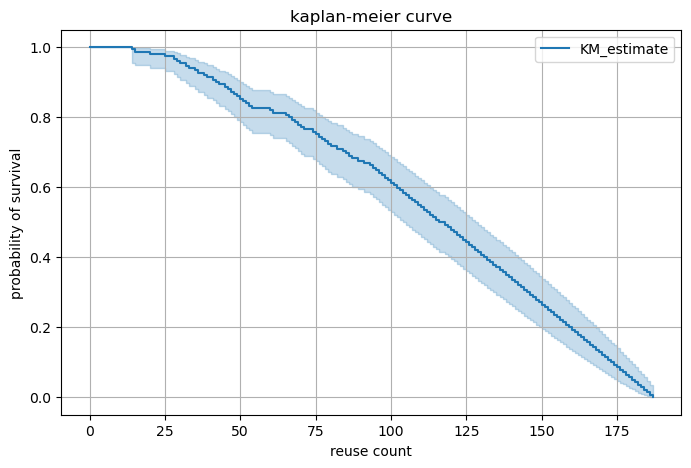
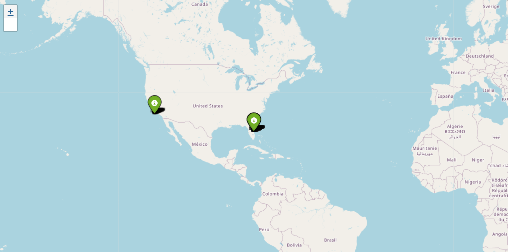

# 🛰️ SpaceX Falcon 9 Landing Analysis

Analyze SpaceX Falcon 9 missions using survival analysis, geospatial maps, and EDA to uncover factors behind successful landings.

## 🚀 Highlights
- Fetched real-time data via SpaceX public API
- Flattened nested JSON (e.g., cores, rockets, launchpads)
- Kaplan-Meier survival curve using `lifelines`
- Interactive launch site map with `folium`
- Visualized booster reuse, landing types, and flight experience

## 🛠️ Tech Stack
- Python, Pandas, Matplotlib, Seaborn
- Lifelines, Folium, Requests
- Jupyter Notebook

## 📊 Sample Visuals

### Kaplan-Meier Survival Curve

### Launchpad Map

## 📦 Data Source
[SpaceX Launches API](https://api.spacexdata.com/v4/launches)
